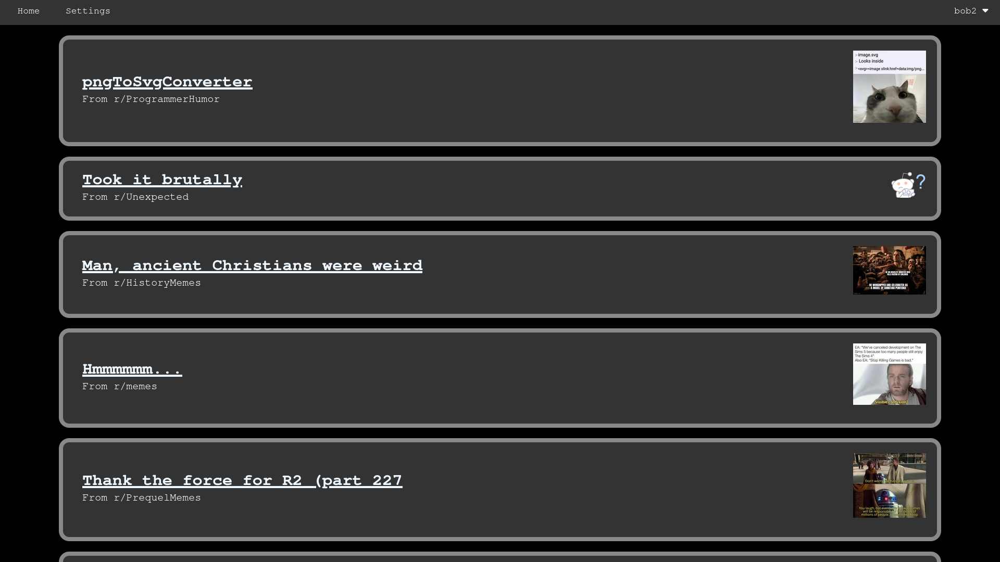
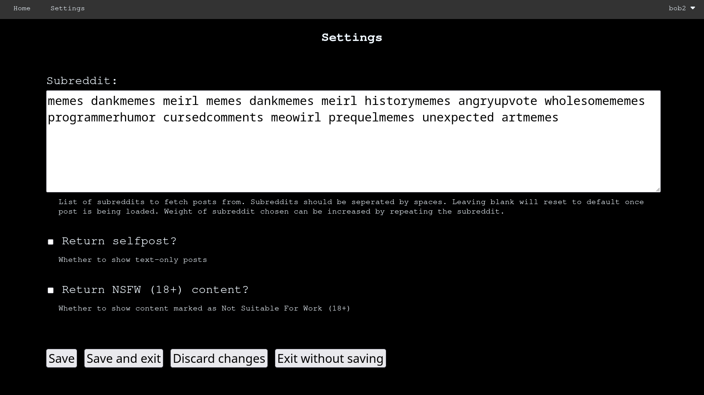

# Meme page

Grabs a random post from the specified subreddit and shows it to the user in a web browser.

Subreddit can be specified in settings.

Supported post types:
- Images (including GIFs)
- Videos
- YouTube Embeds
- Selfpost/text-only (default off)
- NSFW content (default off)

Unsupported post types:
- Gallery/image carousell (Not sure how to implement)
- Other types? (e.g. polls)

## Subreddit settings

Default list of subreddits are:
- r/memes       (weight: 2)
- r/dankmemes   (weight: 2)
- r/meirl       (weight: 2)
- r/historymemes
- r/angryupvote
- r/wholesomememes
- r/programmerhumor
- r/cursedcomments
- r/meowirl
- r/prequelmemes
- r/unexpected
- r/artmemes

Leave the subreddit field blank and save to return to the default.

# Live version

To see a live version of the webapp, click [here](https://ffgtfgh.pythonanywhere.com)

# Hosting the server

To use the project, you must first have a Reddit client ID and client secret.

[praw.ini](./praw.ini) requires `client_id`, `client_secret` and `user_agent`.

To read more on `client_id`, `client_secret` and `user_agent`, read [Reddit's API wiki page](https://github.com/reddit-archive/reddit/wiki/API). You will need a reddit account to generate a `client_ID` and `client_secret`

[config.py](./config.py) requires `SECRET_KEY`.

`SECRET_KEY` can be any random string (UTF-8?) as it is used to encrypt cookies.

## Dependencies
Dependencies are listed in [requirements.txt](./requirements.txt).

To install dependencies simply run `pip install -r requirements.txt`.

## WSGI

If you have a WSGI server simply add these lines to wsgi.py:

`from meme_page import create_app()`

`application = create_app()`

The database will be automatically be created if it does not exist in instance/databse.db

## Flask server

If you want to test it out first simply run the `apprun.py` file.

The server will run on port 8080.

This is a development server and is not meant for real use.

# Gallery

### Bookmarks

### Settings

### Main page
