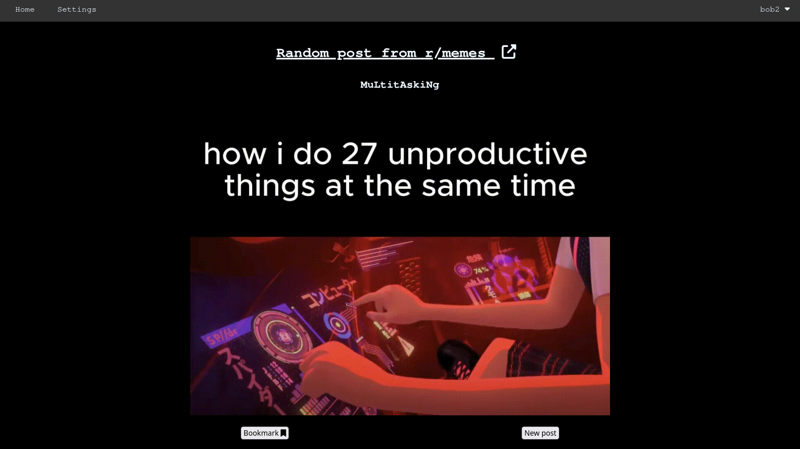
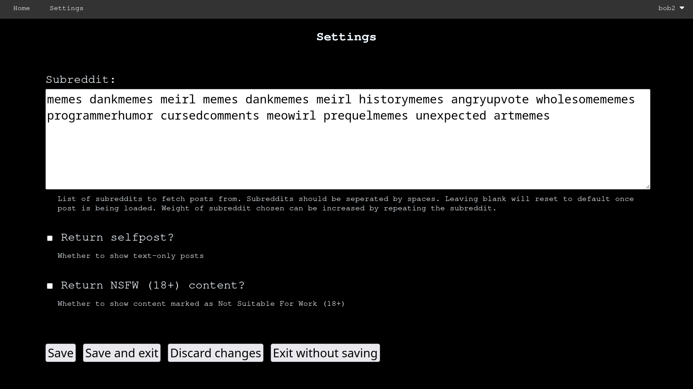
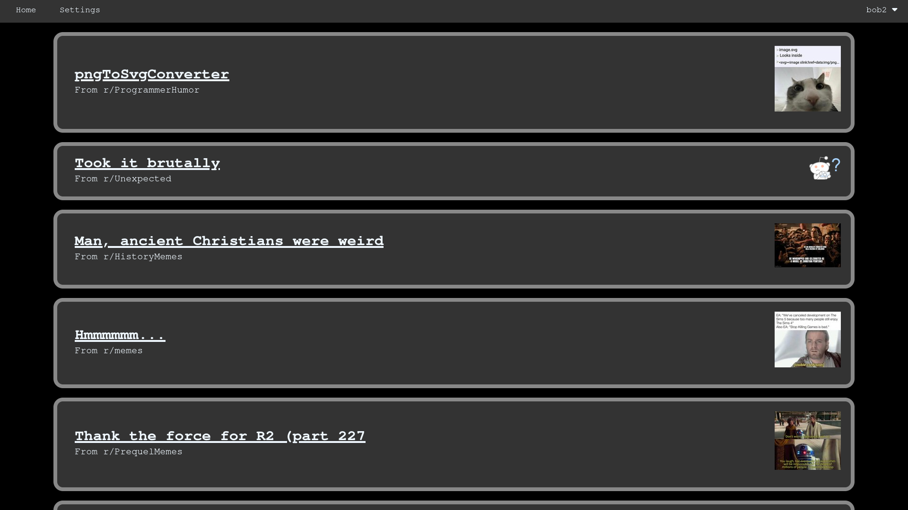
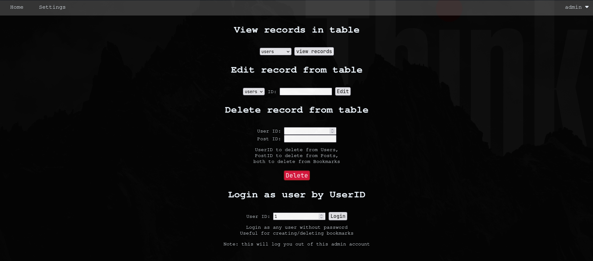

# Dummy Walkthrough

## View a post
Simply go to `/` (homepage) to get a post.

Press 'New post' button or reload page to get a new post

## Change settings
Press the 'Settings' button on the home page.

Change settings as you need.

Default configuration:

Press 'Save and exit' to save new settings and return to homepage.

Pressing 'Save' will save settings but will not redirect to homepage

## Account

### Signup

Press the 'Account' dropdown in the menu to access the 'Signup' button.

Enter credentials to create an account

Username must be at least 4 alphanumeric characters 

### Login

Press the 'Account' dropdown in the menu to access the 'Login' button.

Enter valid credentials and you will be redirected to /account if successful in logging in. Invalid credentials will result in error and you need to re-enter credentials.

### Logout

Press the 'Logout' button in the dropdown menu to logout. Javascript prompt will confirm if you want to logout.

## Bookmarks

### Add bookmark

After logging in, a 'Bookmark' button will appear under posts in the homepage. Press the button to bookmark the post. If successful, a green banner will popup. Any error will result in no banner.

### View bookmarks

When logged in, press the dropdown in the menu to access the Bookmarks page. Bookmarks will be shown like this:

Click on the title to view the bookmark in a new tab.

### Delete bookmark

When viewing the bookmark, press the 'Delete bookmark' button to delete it.

## Admin Console

To access admin console, login as 'admin' and admin console can be accessed through dropdown menu or `/adminconsole`.

Creating new records can be done by signing up or logging in as user to create new bookmark.

Bookmarks cannot be edited, only created/deleted

Tables can also be viewed at `/adminconsole/view/<table>` (requires logged into admin account)

Modifying records is discouraged as it can result in broken data. It is better to create and delete instead (except for changing usernames).

